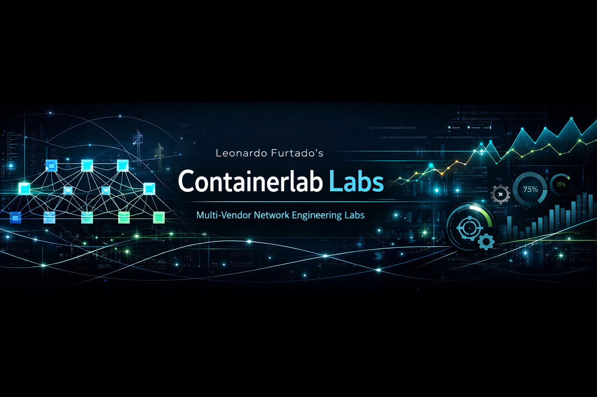
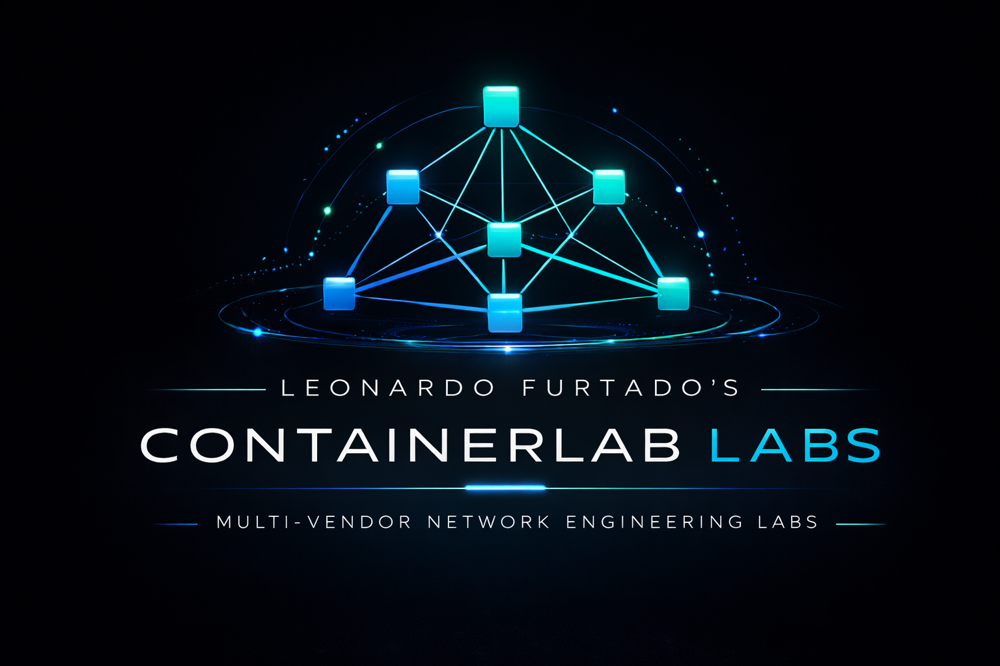

# Leonardo Furtado's Containerlab Labs

| Item | Details |
|---|---|
| Author | Leonardo Furtado |
| GitHub | [leofurtadonyc](https://github.com/leofurtadonyc/) |
| LinkedIn | [Leonardo Furtado](https://www.linkedin.com/in/leofurtadonyc/) |

> [!IMPORTANT]
> If you enjoy this project or find this repository useful, please consider **starring it on GitHub** and **sharing it with others and your communities**. That helps the project reach more people and keeps the work visible.

<p align="center">
  
</p>

**A flagship network engineering lab platform for serious service provider, data center, transport, observability, and automation work**

## Disclaimer

Lab images, vendor software, and licenses are **not** distributed in this repository.

You must provide any required images, bring your own licenses where needed, and comply with all vendor and third-party licensing terms.

Also, read the "What You Need to Run These Labs" section before getting started.

## Stay Up to Date

**This repository moves fast.** New labs, architecture updates, configuration changes, automation improvements, fixes, and documentation refinements are added regularly.

To avoid drift and make sure you are working from the latest state of the project, pull updates frequently:

```bash
git pull
```
If you are actively using this repository, staying current is strongly recommended!

---

## Start Here

This is not a throwaway lab repo.

**Leonardo Furtado's Containerlab Labs** is a growing, production-minded network engineering lab platform for engineers who want to go far beyond toy topologies, isolated protocol demos, and certification-style exercises.

It is a place to design, deploy, validate, observe, troubleshoot, and evolve realistic network environments across multiple architectures, vendors, and operational models.

From **service provider transport** to **EVPN-VXLAN Clos fabrics**, from **telemetry and dashboards** to **automation and drift-aware validation**, this repository is built to help engineers treat labs the way serious teams treat real systems: as environments for evidence, experimentation, and engineering judgment.

| Item | Details |
| --- | --- |
| Best first lab | `ceos-4s4l` |
| Skill level | Intermediate to advanced |
| Runtime | Docker / OrbStack + Containerlab |
| Automation | Python 3.10+ |

### Quick Path

```
git clone https://github.com/leofurtadonyc/containerlab.git
cd containerlab
cd ceos-4s4l
# read the lab-specific README first
sudo containerlab deploy-t topology.clab.yml
```

> [!TIP]
> 
> 
> Start with one lab, read its local README thoroughly, confirm the image and license requirements, deploy, validate the baseline, and only then begin making changes.
> 

---

## Featured Labs

| Lab | Domain | Vendors | What You Learn | Difficulty | Status |
| --- | --- | --- | --- | --- | --- |
| `ceos-4s4l` | DC Fabric | Arista | Clos underlay, EVPN-VXLAN, validation | Intermediate | Stable |
| `ceos-2dc-evpn-dci` | Multi-DC | Arista | DCI, stretch vs isolation, fault domains | Advanced | Active |
| `nokia-sr-mpls` | SP Transport | Nokia | MPLS, services, transport troubleshooting | Advanced | Active |
| `observability-stack` | Telemetry | Multi-tool | Metrics, dashboards, evidence workflows | Intermediate | Growing |

> [!TIP]
> 
> 
> More labs will continue to be added over time. Keep checking the repository for new scenarios, refinements, and supporting workflows.
> 

---

## What You Need to Run These Labs

These labs are built on **Containerlab**, so before you begin, it helps to understand the basic stack and practical requirements.

### What Is Containerlab?

**Containerlab** is a CLI tool for building and managing **container-based network labs**. It deploys nodes, creates virtual links between them, and manages the lab lifecycle from a topology file. That makes it a strong fit for repeatable, automation-friendly network topologies.

### Why Docker Matters Here

Containerlab needs a **container runtime** to run lab nodes. The most common runtime is **Docker**. Docker Engine is the layer that actually runs the containers used by the lab. Containerlab sits on top of that runtime and orchestrates those containers into a network topology.

Put simply:

- **Docker** runs the containers
- **Containerlab** turns those containers into a network lab

### Supported and Practical Environments

The most common working paths are:

| Platform | Status | Notes |
| --- | --- | --- |
| Linux + Docker | Recommended | Best compatibility for most labs |
| macOS + OrbStack | Recommended | Strong option for Mac users |
| macOS + Docker Desktop | Supported | Works, though often heavier |
| Other runtimes | Varies | Some adaptation may be required depending on the lab |

### Setup Guides

Before using this repository, make sure your local environment is ready:

- **Containerlab installation:** Follow the official install guide
- **Containerlab quick start:** Useful if you are new to the workflow
- **Docker installation:** Follow Docker’s official install documentation for your platform
- **Docker post-install steps (Linux):** Recommended for permissions and usability after install
- **macOS users — OrbStack (recommended):** OrbStack includes a Docker engine and is a strong option for running containers on Mac
- **OrbStack quick start / install:** Use the official docs to get started

### Images, Vendor Software, and Licenses

**This repository does not provide lab images, vendor software, or licenses.**

That means:

- You must provide any required container images yourself
- You must bring your own vendor licenses where needed
- You must comply with all vendor and third-party licensing terms

This repository provides the **lab definitions, supporting assets, documentation, and automation/workflow material** — but not the proprietary software required to run vendor-specific nodes.

### Practical Expectations

At a minimum, most users will need:

- A machine capable of running containers
- A working Docker-compatible runtime
- Containerlab installed
- Access to the required lab images
- Any required vendor licenses, where applicable
- Enough CPU, memory, disk, and networking capacity for the topology they want to run

> [!IMPORTANT]
> 
> 
> Some labs are intentionally resource-intensive and can consume a significant amount of RAM and CPU. Capacity expectations and lab-specific requirements should be documented in each lab’s local `README.md`.
> 

If you are new to this ecosystem, the best order is simple: install Docker or OrbStack, install Containerlab, verify your runtime works, then return to this repository and choose a lab.

---

## Why This Project Exists

Too many labs stop at “it came up.”

That is not enough.

Real networks are shaped by trade-offs, failure domains, visibility gaps, tooling constraints, architectural evolution, and the constant tension between speed and safety. Protocol knowledge matters, but protocol knowledge alone does not build engineering maturity.

This repository exists to help close that gap.

It is built to help engineers:

- Understand how systems behave beyond happy-path demos
- Test architecture in context, not in isolation
- Validate assumptions with evidence
- Explore how observability changes troubleshooting
- Use automation to reduce guesswork and increase confidence
- Build deeper intuition across technologies, vendors, and operational patterns

The goal is simple:

**To make labs feel more like engineering, and engineering more intentional.**

---

## What This Repository Is

This repository is a living collection of high-value network engineering labs and supporting assets built around realism, modularity, and operational depth.

It is designed to support work across areas such as:

- **Service provider and carrier-grade scenarios**
- **Data center and EVPN-based fabric architectures**
- **Transport, routing, and traffic-engineering experimentation**
- **Multi-vendor learning and comparison**
- **Observability-first workflows**
- **Python-driven automation, validation, and drift analysis**

It is not tied to a single protocol, a single vendor, or a single architectural style.

The long-term direction is to grow this into a broader engineering lab platform that supports focused technical experiments, architecture studies, operational drills, validation pipelines, and reusable learning paths across multiple network domains.

---

## Who This Is For

This repository is for engineers who want more than shallow labs and neat screenshots.

It is built for:

- Network engineers who want depth instead of toy demos
- Service provider engineers exploring transport and service behavior
- Data center engineers working with Clos, EVPN, and multi-site patterns
- Automation-minded infrastructure engineers who want repeatable validation
- Reliability-minded operators who care about evidence, visibility, and safe change
- Advanced learners who want to sharpen real engineering instincts
- Builders who see labs as systems, not as disposable exercises

If you value realism, technical honesty, and meaningful experimentation, this repo is for you.

---

## What You Can Explore Here

### Service Provider and Transport Engineering

Build and study provider-style topologies, transport systems, service layers, routing interactions, and operational design patterns that reflect more realistic network behavior.

### Segment Routing and Modern Forwarding Models

Explore modern transport evolution, policy-driven path control, SR-oriented thinking, and the architectural shift beyond legacy-only approaches.

### BGP and Advanced Control Plane Behavior

Test route distribution, policy interactions, service signaling patterns, and advanced control-plane scenarios across richer topologies.

### Data Center Fabrics and EVPN-VXLAN

Work with Clos-based designs, EVPN-VXLAN models, underlay/overlay interactions, multi-site patterns, and fabric-centric operational thinking.

### Observability and Operational Visibility

Integrate telemetry, monitoring, metrics, dashboards, and evidence-driven workflows so the lab becomes something you can see, not just configure.

### Automation and Validation

Use Python and automation-oriented workflows to validate state, detect drift, reduce repetitive checking, and make experimentation safer and more repeatable.

---

## What Makes This Project Different

Many repositories provide files. This one is being built to give you **engineering leverage**.

That means:

- **Realism over neatness**: labs should reflect system behavior, not just clean diagrams
- **Architectures over isolated features**: technologies matter more when they interact
- **Evidence over intuition alone**: if you cannot validate it, you do not fully understand it
- **Observability built in**: visibility is part of the design, not an afterthought
- **Automation with purpose**: scripts should reduce uncertainty and improve trust
- **Vendor-aware, concept-first learning**: vendors matter, but principles matter more
- **Built to evolve**: this is not a static archive but a growing engineering platform

---

## Current Scope and Direction

This repository is intentionally broad and will continue expanding.

It already includes meaningful work across multiple technical domains, including:

- **Arista-based EVPN-VXLAN Clos labs**
- **Fabric and multi-DC experimentation**
- **Nokia-heavy service provider and transport scenarios**
- **Automation-driven validation workflows**

It is also designed to support, over time, areas such as:

- Service provider and carrier-grade transport environments
- MPLS and label-switched architectures
- Segment Routing and SRv6-oriented labs
- BGP-centric routing and service models
- EVPN-VXLAN data center fabrics
- Clos architectures
- Multi-site and interconnect patterns
- L2 and L3 service scenarios
- Telemetry and metrics collection workflows
- Monitoring and dashboard integrations
- Python-based validation and automation pipelines
- Multi-vendor topologies and architecture comparisons

The ambition is not to become a single-topic sandbox. It is to become a serious lab library and engineering reference that stays useful over time.

---

## Getting Started

### What You Will Need

You will typically need:

- A Docker-compatible container runtime
- `containerlab`
- Access to any required container or vendor images
- Python 3.10+ for automation workflows
- Any required licenses for vendor-specific software

### Basic Flow

1. Select a lab scenario
2. Read that lab’s local README carefully
3. Prepare the required images, licenses, and environment
4. Deploy the topology with `containerlab`
5. Verify baseline reachability and service state
6. Run automation and validation checks where applicable
7. Introduce changes, tests, or failure drills
8. Observe the results
9. Re-validate and learn from the outcome

### The Right Mindset

The best results come when you treat this repository like an engineering platform: define expectations first, validate deliberately, observe everything you can, keep changes controlled, and learn from broken states, not only working ones.

---

## Suggested Paths Through the Repository

### Path 1 — Data Center Fabric Engineering

Start with Clos and EVPN-VXLAN labs to understand underlay/overlay behavior, segmentation, reachability, and fault domains.

### Path 2 — Service Provider and Transport Foundations

Work through provider-style labs to understand service layering, transport behavior, and operational design patterns.

### Path 3 — Multi-Site and Interconnect Patterns

Study larger-scope behavior across multi-DC and interconnect scenarios where the architecture becomes more interesting.

### Path 4 — Observability and Operational Evidence

Bring in telemetry, dashboards, and monitoring to make your lab visible and measurable.

### Path 5 — Automation and Drift-Aware Validation

Use the automation framework to move from manual CLI spot checks toward repeatable evidence and confidence-based workflows.

---

## Repository Structure

The exact layout will continue evolving, but the intent is clear:

- **Lab directories** contain topologies, configs, and architecture-specific assets
- **Automation/** contains Python-based validation, source-of-truth, and drift-aware workflows
- **Documentation assets** provide explanations, design notes, and learning material
- **Observability-related assets** support telemetry, monitoring, dashboards, and visibility-oriented integrations
- **Supporting files** provide scenario-specific helpers, references, and project structure

As the repository grows, you can expect more labs, architectures, vendors, and reusable engineering components. Over time, this will also include more containerized environments with customized observability and telemetry capabilities, expanding the automation and evidence-gathering experience across the platform.

---

## Important Boundaries

### Vendor Images and Licensed Software

As mentioned earlier, vendor images, licensed NOS artifacts, and proprietary software are **not** included in this repository unless explicitly stated otherwise.

You are responsible for:

- Supplying required images
- Supplying required licenses
- Complying with all vendor-specific terms and restrictions

### Third-Party Software

This repository may reference, pull from, or integrate with third-party tools and platforms, such as monitoring systems, dashboards, and containerized services. Those components remain under their own licenses and rights.

Examples may include Grafana, Prometheus, and other related tooling.

### Advanced Scope

Some labs are intentionally deep and assume a baseline understanding of networking, fabrics, routing, transport, or automation. This is by design.

---

## Roadmap

This project is actively expanding.

Expected growth areas include:

- More architecture variants
- Broader multi-vendor support
- Deeper provider and transport scenarios
- Richer EVPN and DCI patterns
- Stronger telemetry and observability coverage
- Improved automation abstraction
- More robust drift semantics
- Better CI-friendly validation patterns
- Larger, higher-quality engineering walkthroughs
- Clearer progression paths for learning and experimentation

The ambition is straightforward:

**To build a lab platform that remains genuinely useful to serious network engineers over time.**

---

## Contributing

Thoughtful, technically grounded contributions are welcome.

Valuable contributions include:

- Extending lab scenarios
- Improving validation workflows
- Documenting real failure modes
- Refining operational clarity
- Strengthening observability
- Improving modularity and reuse
- Adding depth without adding noise

### Before You Open an Issue or Pull Request

Before opening an issue or submitting a Pull Request, please do the following:

1. **Understand the existing lab or workflow first**
    
    Make sure you understand the purpose of the lab, the intended behavior, and how your change fits into the repository's broader design.
    
2. **Validate the change locally**
    
    Test your changes in your own environment whenever possible. Do not submit untested modifications to topologies, configs, automation, dashboards, or documentation that affect technical accuracy.
    
3. **Check for overlap**
    
    Review existing folders, files, and documentation to avoid duplicating work, introducing conflicting approaches, or creating unnecessary drift.
    
4. **Open an issue first for significant changes**
    
    If your contribution is large, architectural, cross-cutting, or changes the intended direction of a lab, open an issue first to explain the idea before investing time in a Pull Request.
    
5. **Make sure you have the right to contribute the content**
    
    Only submit material you wrote yourself or are clearly allowed to contribute. Do not submit vendor-proprietary content, licensed images, restricted software, or third-party assets that cannot be redistributed.
    

### Common First Checks

Before opening an issue, confirm the following:

- `containerlab version` is working
- your container runtime is healthy
- required images are present locally
- required licenses are in place where needed
- your host has enough RAM and CPU for the chosen lab
- you followed the lab-specific README
- you captured relevant logs, outputs, and validation evidence

### Git / GitHub Collaboration Workflow

Please follow a clean Git/GitHub workflow:

1. **Fork the repository** to your own GitHub account
2. **Create a dedicated branch** for your work
3. **Keep changes focused** on one clear improvement or fix
4. **Use clear commit messages** that explain intent
5. **Sync with upstream before submitting** so your PR is based on the latest state of the repository

Example branch names:

- `fix/evpn-bgp-neighboring`
- `feat/add-sr-lab-validation`
- `docs/improve-readme-clarity`

Example commit messages:

- `Fix EVPN leaf-spine BGP peering in dc1 lab`
- `Add validation checks for Nokia SR MPLS lab`
- `Improve observability setup instructions`

### Pull Request Expectations

A good Pull Request should clearly explain:

- **What behavior is expected**
- **What behavior was observed**
- **What changed**
- **How it was validated**
- **Why the change improves the repository**

Where applicable, include:

- affected lab or folder name
- relevant topology or scenario
- validation output, screenshots, logs, or brief evidence
- assumptions, caveats, or limitations

### Pull Request Rules

Please keep these rules in mind:

- **Do not submit untested technical changes** unless the PR is explicitly documentation-only
- **Do not include unrelated refactors** in the same PR
- **Do not remove existing functionality** without clearly explaining why
- **Do not introduce breaking changes silently**
- **Do not commit secrets, credentials, private keys, or licensed vendor artifacts**
- **Do not add images, binaries, or large files unless they are necessary and justified**

### Quality Standard

Contributions should aim to preserve the spirit of this repository:

- Realistic
- Useful
- Modular
- Technically honest
- Operationally meaningful

This project values clarity, rigor, usefulness, engineering judgment, and technical honesty.

### Branch Naming Convention

Use branch names that are short, descriptive, and scoped to the type of change being made.

Recommended prefixes:

- `feat/` for new functionality or new lab additions
- `fix/` for bug fixes or technical corrections
- `docs/` for documentation-only changes
- `refactor/` for structural improvements that do not intentionally change behavior
- `test/` for validation or test-related additions
- `chore/` for repository maintenance or housekeeping work

Examples:

- `feat/add-evpn-multisite-lab`
- `fix/nokia-mpls-label-validation`
- `docs/improve-containerlab-setup-section`
- `refactor/cleanup-automation-layout`

Keep branch names:

- lowercase
- hyphen-separated
- specific to one change set

### Pull Request Checklist

Before submitting a Pull Request, confirm that:

- [ ]  I reviewed the existing repository structure and avoided unnecessary duplication
- [ ]  I tested the change locally, or this is a documentation-only change
- [ ]  My change is focused on one clear improvement or fix
- [ ]  My branch is up to date with the latest upstream changes
- [ ]  My commits are clear and relevant to the change
- [ ]  I did not include secrets, credentials, private keys, or licensed vendor artifacts
- [ ]  I explained what changed and why
- [ ]  I described how the change was validated
- [ ]  I documented any important caveats, assumptions, or limitations
- [ ]  I preserved the technical quality and intent of the repository

### Preferred Pull Request Style

A strong Pull Request is easy to review, narrow in scope, technically justified, supported by evidence, and consistent with the repository’s direction.

If your contribution is large, consider splitting it into smaller PRs to make review easier and safer.

---

## Licensing

### Code

Unless otherwise noted, source code, scripts, automation, telemetry, monitoring, validation, and other software components in this repository are licensed under the **GNU Affero General Public License v3.0 (AGPL-3.0)**.

See: `LICENSE`

### Content

Unless otherwise noted, non-code materials in this repository — including documentation, diagrams, lab guides, walkthroughs, architecture explanations, and other educational materials — are licensed under the **Creative Commons Attribution-NonCommercial-ShareAlike 4.0 International (CC BY-NC-SA 4.0)** license.

See: `LICENSE-CONTENT`

### Third-Party Software and Assets

Third-party software, container images, vendor operating systems, trademarks, logos, and external assets referenced by this repository remain subject to their own licenses and rights.

See: `THIRD-PARTY.md`

---

## About the Author

**Leonardo Furtado**

This repository reflects an engineering-first philosophy: one that values realism, architecture, operational depth, observability, and automation as parts of the same discipline.

It is built by someone who believes labs should do more than demonstrate syntax.

Labs should sharpen judgment, expose tradeoffs, and make better engineers.

---

## Let's Begin!

This repository is being built for engineers who want their labs to mean something.

Not just to launch containers and topologies.

Not just to memorize commands.

Not just to say a protocol “works.”

But to understand how systems behave, how designs hold up, how tooling changes outcomes, and how disciplined engineering creates confidence.

If that is the kind of work you care about, this repository was built with you in mind.

<p align="center">
  
</p>
