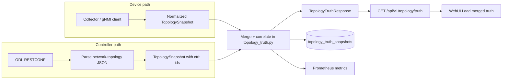

# Deeper topology truth v1 — implementation deep dive

This document expands on the bounded contract ([`deeper-topology-truth-contract-v1.md`](deeper-topology-truth-contract-v1.md)) and ADR ([`decisions/ADR-0007-deeper-topology-truth-v1.md`](decisions/ADR-0007-deeper-topology-truth-v1.md)) with **end-to-end implementation detail**: data paths, correlation rules, API and persistence behavior, observability, WebUI, verification, and explicit limits.

It reflects the code as of the **Deeper topology truth v1** program plus follow-up work on **BGP-LS / ODL `network-topology`** enrichment (RESTCONF subtree reads and scope markers).

---

## 1. What problem this solves

The platform already exposes a **normalized topology** from **gNMI-backed collection** (`GET /api/v1/topology`). That model is honest about **inference** (e.g. interface-derived links) and **partiality**, but operators still need a **single backend-owned read** that can say, where evidence exists:

- whether an adjacency is **only inferred**, **device-observed**, **correlated with controller export**, or **in conflict**;
- **which sources** contributed;
- **freshness** and **disagreement** without pretending **datapath**, **TE path**, or **service dependency** truth.

**`topology_truth_v1`** is that merge. It does **not** make ODL the product’s sole authority; it **ingests** controller topology as **optional enrichment** and keeps the **backend** as the merge owner.

---

## 2. Stable contract identity

| Field | Value |
| --- | --- |
| **`contract_id`** | `topology_truth_v1` |
| **Phase metadata** on responses | `phase_2_read_only_foundation` (service metadata; see `topology_truth.py`) |
| **Primary HTTP surface** | `GET /api/v1/topology/truth` |
| **Optional query** | `truth_posture=<label>` — filters merged **nodes** and **links** to rows whose `truth_posture` equals that label (applied **after** full merge) |

---

## 3. Repository map (authoritative code locations)

| Area | Path |
| --- | --- |
| Merge service | `platform/app-api/src/app_api/services/topology_truth.py` |
| ODL / RESTCONF ingestion | `platform/app-api/src/app_api/integrations/odl/bgp_ls_topology.py` |
| ODL client (base URL, headers, timeout) | `platform/app-api/src/app_api/integrations/odl/client.py` |
| Pydantic schemas / API model | `platform/app-api/src/app_api/schemas/topology_truth.py` |
| HTTP route | `platform/app-api/src/app_api/routers/topology.py` |
| Internal graph models | `platform/app-api/src/app_api/models/topology.py` |
| Shared snapshot loader | `platform/app-api/src/app_api/services/topology.py` → `load_topology_snapshot_for_topology_relationship_queries()` |
| Postgres table ORM | `platform/app-api/src/app_api/persistence/tables.py` → `TopologyTruthSnapshotTable` |
| Alembic migration | `platform/app-api/alembic/versions/20260329_0011_topology_truth_v1.py` |
| Metrics | `platform/app-api/src/app_api/metrics/state.py` → `record_topology_truth_observation`, Prometheus text emission |
| Web API client | `platform/app-web/src/api/client.ts` → `getTopologyTruth()` |
| TS contracts | `platform/app-web/src/api/contracts.ts` |
| Topology page UI | `platform/app-web/src/features/topology/view.tsx` |
| Backend tests | `platform/app-api/tests/test_topology_truth.py`, `platform/app-api/tests/test_bgp_ls_topology.py` |
| Runtime verifier | `platform/scripts/verify-core-runtime.sh` (topology truth JSON + metrics + JS marker) |
| Product marker test | `platform/app-web/tests/week37-verifier-bundle-markers.test.ts` |

---

## 4. High-level data flow



---

## 5. Device / gNMI baseline (must match `GET /topology`)

The merge **does not reimplement** topology collection. It calls:

```text
load_topology_snapshot_for_topology_relationship_queries()
```

which returns `(collector_snapshot, device_snapshot, persisted_at)` and is documented to align with **`GET /api/v1/topology`**:

- **`device_snapshot`**: `TopologySnapshot` — nodes, links, `topology_id`, `observed_at`, `notes`, etc.
- **`collector_snapshot`**: `CollectorTopologySnapshot` — status (e.g. `collector_unavailable`, `live_normalized_feed`), inference/endpoint/collection postures used for **freshness** and **stale** semantics.
- **`persisted_at`**: if the current view is being served from **persisted** normalized topology history, this is non-`None` and influences **merged_view** freshness (see below).

**Implication:** Anything true about **inference**, **single-sided links**, and **coverage** on the main topology page applies to the **device** side of the merge. The truth endpoint **adds** controller correlation; it does not upgrade inference to protocol truth by itself.

---

## 6. Controller enrichment: `fetch_bgpls_topology_via_odl()`

Implementation: `integrations/odl/bgp_ls_topology.py`.

### 6.1 Purpose

Produce a second `TopologySnapshot` labeled **`sync_source="controller_bgpls"`** from **bounded** RESTCONF reads of **network-topology** data. This snapshot **alone** is not the product truth; the **merge** in `topology_truth.py` owns the operator-facing semantics.

### 6.2 RESTCONF path selection

The client tries, **in order**:

1. **`/rests/data/ietf-network-topology:network-topologies`** (RFC 8345 style)
2. **`/rests/data/network-topology:network-topology`** (legacy / alternate registration)

Behavior:

- **HTTP 401/403**: return **`BgplsTopologyFetchResult`** with **`status="empty"`**, empty snapshot, explanatory **notes** (enrichment unavailable; gNMI baseline remains).
- **HTTP 404** or **400** with RESTCONF body indicating **`unknown-element`**: **try the next path** (module not registered on this ODL build).
- **Other HTTP errors** on a candidate path: **`status="degraded"`**, empty snapshot, note with status code.
- If **no path** yields JSON: **`status="empty"`** with notes that neither module was exposed.
- **URLError / timeout / JSON errors**: **`status="unreachable"`**, empty snapshot.

### 6.3 Parsing `network-topology` JSON

`_parse_network_topology_payload()` accepts multiple shapes:

- `ietf-network-topology:network-topologies` → `topology` list
- `network-topology:network-topology` → `topology` list
- Legacy `network-topology` dict or list forms

For each topology object:

- **Nodes**: `node-id` → internal `TopologyNode` with **`node_id = f"ctrl:{nid}"`** (prefix distinguishes controller namespace from device ids).
- **Links**: Prefer parsing `link-id` of the form **`a:b:c`** (split into source/target when possible); else use IETF **`source` / `destination`** termination points (`source-node`, `dest-node`, refs). Links get **`link_id = f"ctrl:{src}::{tgt}"`**, **`endpoint_pairing_state="paired"`**, **`endpoint_evidence_count=2`** when built from structured TP data.

**Fingerprint:** `sha256(sorted JSON of payload))[:32]` for the raw dict (or error payload) — used for **`controller_bgpls_fingerprint`** in DB and debugging.

### 6.4 BGP-LS subtree enrichment (recent extension)

If the aggregate list includes **BGP-Linkstate** topologies (detected via `topology-types` keys containing `bgp-linkstate` / `linkstate`) **but** that topology id was not yet populated with nodes/links from the aggregate response, the code may **`GET`**:

```text
/rests/data/network-topology:network-topology/topology/{topology-id}
```

(URL-encoded id.) Parsed nodes/links are **merged** into the same snapshot; **notes** record how many nodes/links were merged per subtree.

### 6.5 Scope markers (empty topology list entries)

If a topology id appears in the **list** but has **no** `node`/`link` arrays with content, the code can append a **synthetic node**:

- **`node_id`**: `ctrl:topo:{topology-id}`
- **`role`**: `controller_topology_scope`
- **`display_name`**: `scope:{topology-id}`
- **Attributes**: topology id, inferred kind (`bgp_linkstate`, `pcep`, etc.), `controller_topology_scope=true`

This marks **protocol/controller presence** without fabricating adjacency detail. In **merge**, these nodes are treated as **`controller_correlated`** without generating **`missing_device_evidence`** disagreements (see `topology_truth.py` loop over controller-only nodes).

### 6.6 Resulting `ControllerFetchStatus`

| `status` | Meaning (simplified) |
| --- | --- |
| **`ok`** | Parsed at least one node or link (or meaningful content — empty graph with only scope markers may still be classified per notes in code path) |
| **`empty`** | No usable topology elements / auth blocked / modules missing |
| **`degraded`** | HTTP or parse failure short of total disconnect |
| **`unreachable`** | Network-level failure, timeout, bad JSON |

The API exposes this as **`controller_fetch_status`** on every `TopologyTruthResponse`.

---

## 7. Identity and correlation rules

### 7.1 Node identity

- **Device nodes** use platform **node_id** strings (no `ctrl:` prefix).
- **Controller nodes** use **`ctrl:{opaque-id}`** from ODL.
- **Matching key:** `_norm_ctrl_id(node_id)` strips a leading **`ctrl:`** so **`ctrl:router1`** can match device **`router1`** if the same logical NE is named consistently.

**If both sides present the same normalized id:** rows are **merged** with posture **`multi_source_confirmed`** (or **`conflicting`** if `state` differs).

**Controller-only nodes:**

- **`controller_topology_scope`**: surfaced as **`controller_correlated`**, no “missing device” disagreement.
- **Other roles**: **`partial`**, **`missing_sources`** includes `device_gnmi`, **`TopologyDisagreementRecord`** kind **`missing_device_evidence`**.

### 7.2 Link identity

Links are keyed by **undirected** pair **`_link_key(a, b)`**: normalize with `_norm_ctrl_id`, order endpoints so **`min ≤ max`**. This avoids missing matches when direction differs between sources.

### 7.3 LLDP physical adjacency and multi-source confirmation

For **device** links, `resolve_topology_link_endpoint_evidence()` (in `models/topology.py`) yields:

- **`paired`**: both endpoints observed / evidence count 2 (details in attributes and collector behavior).
- **`single_sided`**: one-sided inference.

In merge:

- Device link with **no** LLDP rows remains **`inferred_only`**.
- Device link with **one-sided LLDP** becomes **`device_observed`** or **`partial`** when the controller also agrees.
- Device link with **bidirectional LLDP** becomes **`physical_confirmed`**.
- Device link with **bidirectional LLDP** plus matching controller export becomes **`multi_source_confirmed`**.
- Device link with LLDP that contradicts the inferred or controller-correlated peer becomes **`conflicting`** with an explicit LLDP disagreement kind.

**Important:** physical or multi-source confirmation in this slice still does **not** mean RSVP/TE path validation or forwarding-plane verification.

---

## 8. Truth postures and disagreements (runtime behavior)

Defined in `schemas/topology_truth.py` (`TopologyTruthPosture`, `TopologyDisagreementKind`).

### 8.1 Node-level postures (typical cases)

| Situation | Typical `truth_posture` |
| --- | --- |
| Device node, controller match, same state | `multi_source_confirmed` |
| Device node, controller match, different `state` | `conflicting` + disagreement `device_controller_mismatch` |
| Device node, no controller node | `device_observed`; if `ctrl_status == ok`, `missing_sources` may include `controller_bgpls` |
| Controller-only, scope marker role | `controller_correlated` |
| Controller-only, other roles | `partial` + `missing_device_evidence` |

### 8.2 Link-level postures (typical cases)

| Situation | Typical `truth_posture` |
| --- | --- |
| Device + bidirectional LLDP | `physical_confirmed` |
| Device + bidirectional LLDP + controller match | `multi_source_confirmed` |
| Device + one-sided LLDP | `device_observed` or `partial` |
| Device only, single-sided | `inferred_only` |
| Device only, no LLDP | `inferred_only` |
| Device/controller link state mismatch | `conflicting` + `device_controller_mismatch` |
| LLDP contradicts inferred/controller peer | `conflicting` + `lldp_inference_mismatch` or `lldp_controller_mismatch` |
| Controller only | `controller_correlated` |

### 8.3 Disagreement records

`TopologyDisagreementRecord` includes **`object_kind`** (`node` | `link`), **`object_id`**, **`kind`**, human **`summary`**, and optional **`source_a` / `source_b`**.

Kinds used in merge logic include **`device_controller_mismatch`**, **`missing_device_evidence`**, **`missing_controller_evidence`** (via `missing_sources` on provenance — exact disagreement rows follow the service).

**Counts:** `TopologyTruthCounts.conflicting_object_count` counts disagreements whose `kind` is in **`device_controller_mismatch`**, **`identity_conflict`**, **`attribute_conflict`** (see `topology_truth.py`).

---

## 9. Freshness model

`TopologyTruthFreshnessSummary` on the response:

| Field | Logic (simplified) |
| --- | --- |
| **`device_gnmi`** | **`stale`** if collector status is **`collector_unavailable`**, else **`current`** |
| **`controller_bgpls`** | **`not_applicable`** if controller status is **`unreachable`** or **`empty`**; else **`current`** |
| **`merged_view`** | **`stale`** if device is stale **or** `persisted_at` is not `None` (serving from persisted normalized snapshot context); else **`current`** |

Per-object **`TopologyTruthProvenance.freshness_posture`** is **`current`**, **`stale`**, or **`unknown`** depending on source (e.g. device uses collector stale semantics).

---

## 10. HTTP API: `GET /api/v1/topology/truth`

**Router:** `routers/topology.py`.

**Response:** `TopologyTruthResponse` — key fields:

- **`contract_id`**: `topology_truth_v1`
- **`sources`**: `TopologySourceRef[]` for `device_gnmi` and `controller_bgpls` (ids, summaries, freshness, authority posture)
- **`controller_fetch_status`**, **`controller_notes`**
- **`freshness`**, **`counts`**, **`disagreements`**
- **`merged_topology`**: full node/link records with provenance and optional disagreement
- **`persisted_snapshot_id`**: UUID string if Postgres insert succeeded, else `null`
- **`safety_framing`**: default **`explicit_non_claims`** (path/TE/ODL authority boundaries)

**Query `truth_posture`:** After building the full merge, **filters** `merged_topology.nodes` and `merged_topology.links` to elements whose **`truth_posture`** equals the query string (strip whitespace). Useful for focused views without reimplementing filter in the UI.

---

## 11. Persistence: `topology_truth_snapshots`

**Table:** `platform_app.topology_truth_snapshots` (see migration `20260329_0011_topology_truth_v1.py`).

| Column | Role |
| --- | --- |
| **`id`** | UUID string (new row each successful merge attempt that persists) |
| **`persisted_at`** | Timestamptz, indexed |
| **`device_gnmi_fingerprint`** | Short hash of device node set (implementation-defined in `topology_truth.py`) |
| **`controller_bgpls_fingerprint`** | SHA-256 prefix from ODL payload |
| **`controller_fetch_status`** | String status |
| **`merged_payload`** | JSON — full **`TopologyTruthMergedTopology`** dump |
| **`sources_summary`** | JSON — sources + controller_fetch_status |
| **`correlation_notes`** | List of strings (merge notes + ODL notes) |

**Failure mode:** On **`OperationalError`** (e.g. DB down), **`_persist_merged_snapshot`** returns **`None`**; API still returns 200 with merged body; **`persisted_snapshot_id`** is null. Live merge semantics remain authoritative for the read.

**Note:** Rows are **append-style** observations of merged output; product read path is **`GET /topology/truth`**, not “replay from DB only.”

---

## 12. Observability (Prometheus)

Recorded per merge via **`record_topology_truth_observation`** (duration + counts).

Exposed on app-api metrics scrape (see `render_prometheus_text` in `metrics/state.py`):

| Metric | Type | Meaning |
| --- | --- | --- |
| **`platform_app_api_topology_truth_merges_total`** | counter | Total merge computations |
| **`platform_app_api_topology_truth_merge_seconds_sum`** | counter | Sum of merge wall time |
| **`platform_app_api_topology_truth_controller_status_total{status}`** | counter | Merges per `controller_fetch_status` label |
| **`platform_app_api_topology_truth_last_merged_nodes`** | gauge | Last merge node count |
| **`platform_app_api_topology_truth_last_merged_links`** | gauge | Last merge link count |
| **`platform_app_api_topology_truth_last_inferred_only_links`** | gauge | Last inferred-only link count |
| **`platform_app_api_topology_truth_last_physical_confirmed_links`** | gauge | Last bidirectional-LLDP physical confirmation count |
| **`platform_app_api_topology_truth_last_multi_source_confirmed_links`** | gauge | Last LLDP + controller multi-source confirmation count |
| **`platform_app_api_topology_truth_last_conflicts`** | gauge | Last conflict/disagreement count used in observation |

Gauges reflect the **latest** observation in process memory (typical for this codebase’s metrics style).

---

## 13. Web UI (app-web)

**File:** `features/topology/view.tsx`.

- A **`detail-card`** with **`data-product-contract="topology_truth_v1"`** documents the feature for **verifier** substring checks on shipped JS.
- **“Load merged truth”** triggers **`apiClient.getTopologyTruth()`** → **`GET /api/v1/topology/truth`** (no `truth_posture` filter unless extended later).
- On success, the UI shows: **contract id**, **controller fetch status**, **merged node/link counts**, **conflict count**, and **`safety_framing.explicit_non_claims`** bullets.
- The **full** `merged_topology` graph is **not** rendered as a second large table in this panel; it remains available in the JSON for API clients, scripts, and future UI work.

Copy on the card states that the view is **not dataplane path truth** and **not sole ODL authority**.

---

## 14. Readiness / capabilities integration

Elsewhere in the platform, readiness and capability surfaces may still reference **`topology_truth_still_bounded`** (see `schemas/capabilities.py`, `services/capabilities.py`, readiness docs). **Implementing v1 does not automatically clear all broader workflow blockers** — the contract is explicitly **one bounded slice**.

---

## 15. Verification and CI

**`platform/scripts/verify-core-runtime.sh`** (excerpts):

- Fetches **`/api/v1/topology/truth`** and asserts **`contract_id`**, **`merged_topology`**, **`controller_fetch_status`** present.
- Asserts Prometheus output contains **`platform_app_api_topology_truth_merges_total`**.
- Bundled **`app-web`** assets must contain substring **`topology_truth_v1`** (see also `week37-verifier-bundle-markers.test.ts`).

**Tests:**

- **`tests/test_topology_truth.py`**: merge behavior, API route, mocks for snapshot + ODL.
- **`tests/test_bgp_ls_topology.py`**: RESTCONF fallbacks, parsing, scope-node disagreement behavior.

---

## 16. Deployment and connectivity (lab / Containerlab)

For **enrichment** to be non-empty:

- **app-api** must reach **ODL RESTCONF** at the configured base URL (environment/settings used by `OdlClient`).
- **Device topology** still depends on the **collector** path and gNMI targets as for the rest of the platform.

If ODL is unroutable or BGP-LS is not exported into `network-topology`, **`controller_fetch_status`** becomes **`unreachable`/`empty`** and the merge **still returns 200** with **device-only** semantics and explicit notes — **no fabricated controller adjacency**.

---

## 17. Explicit non-goals (do not misread the implementation)

- **Not** end-to-end **traffic path** or **LSP** validation.
- **Not** full **TE** or **SR policy** authority.
- **Not** declaring ODL **omniscient** or **sole** truth — docs and `safety_framing` repeat this.
- **Not** replacing **`GET /topology`**; both remain, with different contracts.
- **Not** universal multi-vendor **federation** in this slice.

---

## 18. Changelog hint (repo history)

- **`Deeper topology truth v1`** introduced merge, API, schemas, persistence, metrics, WebUI panel, ADR, contract doc.
- Follow-up commits extended **`bgp_ls_topology.py`** with BGP-LS subtree fetch and **scope markers**, plus tests — **narrowly** improving honest controller visibility when aggregate RESTCONF is sparse.

---

## 19. Related reading

- [`deeper-topology-truth-contract-v1.md`](deeper-topology-truth-contract-v1.md)
- [`decisions/ADR-0007-deeper-topology-truth-v1.md`](decisions/ADR-0007-deeper-topology-truth-v1.md)
- [`data-flows.md`](data-flows.md) (topology truth bullet)
- [`topology-read-path-coverage-semantics.md`](../schemas/topology/topology-read-path-coverage-semantics.md) (four-axis partiality on primary topology — orthogonal to merge)
