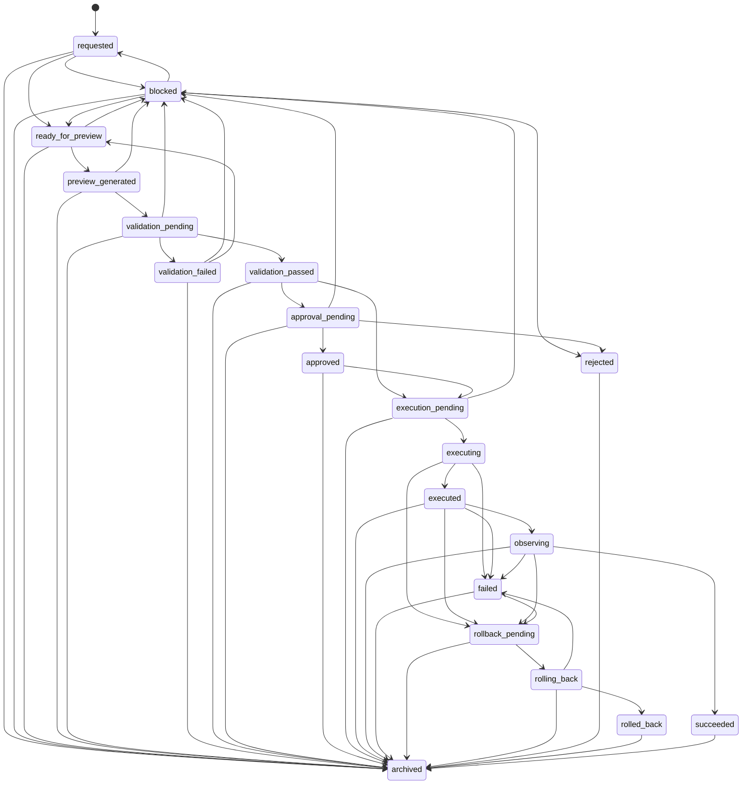

# Workflow Lifecycle Vocabulary

## Purpose

This document defines the bounded workflow lifecycle vocabulary the platform would eventually use.

It exists to make workflow language coherent before any dry-run, validation, approval, execution, or rollback behavior is implemented.

This is a vocabulary and modeling document only.

It does not introduce:

- a workflow engine
- backend workflow behavior
- preview generation
- validation logic
- approval behavior
- execution behavior
- rollback behavior

## Phase Boundary

The platform remains in `Phase 2 — read-only product foundation`.

That means this vocabulary is allowed only as architecture and contract-design groundwork.

It must not be treated as evidence that workflow behavior, dry-run APIs, or action semantics already exist.

## Vocabulary Design Rules

- use explicit `snake_case` state names
- keep lifecycle states vendor-neutral
- keep lifecycle meaning separate from detailed result payloads
- keep approval, validation, execution, and rollback concepts explicit rather than implied
- prefer terms that describe workflow posture, not transport or implementation detail

## Canonical State Vocabulary

The future backend-owned `lifecycle_state` vocabulary should use the following canonical values.

| State | Meaning | Does not mean | Conceptual next states |
| --- | --- | --- | --- |
| `requested` | A workflow request has been created and is now a tracked platform record. | The request is not yet previewable, validated, approved, or executable. | `blocked`, `ready_for_preview`, `archived` |
| `blocked` | The workflow cannot progress because one or more explicit prerequisites, inputs, dependencies, or safety conditions are missing. | It is not rejected, not failed execution, and not a permanent terminal state by itself. | `requested`, `ready_for_preview`, `rejected`, `archived` |
| `ready_for_preview` | The workflow record is complete enough that bounded preview generation can legitimately be attempted. | A preview has not been generated yet, and validation or approval has not happened. | `blocked`, `preview_generated`, `archived` |
| `preview_generated` | A bounded preview artifact exists for the current workflow request. | The preview is not the same thing as validation, approval, or execution. | `blocked`, `validation_pending`, `archived` |
| `validation_pending` | Validation has been requested or scheduled for the current preview or workflow state. | Validation is not complete yet, and no pass or fail conclusion should be inferred. | `blocked`, `validation_passed`, `validation_failed`, `archived` |
| `validation_passed` | Required bounded validation checks passed for the current workflow revision. | The workflow is not yet approved or executed, and future runtime success is not guaranteed. | `approval_pending`, `execution_pending`, `archived` |
| `validation_failed` | One or more required bounded validation checks failed for the current workflow revision. | The workflow is not necessarily rejected forever, and no execution occurred. | `blocked`, `ready_for_preview`, `archived` |
| `approval_pending` | The workflow is waiting for an explicit approval decision under future policy. | It is not approved, rejected, or executing. | `approved`, `rejected`, `blocked`, `archived` |
| `approved` | The workflow has passed the required approval gate for its current revision. | It has not started execution yet, and approval is not proof of runtime success. | `execution_pending`, `archived` |
| `rejected` | The workflow was explicitly declined and will not continue in its current revision. | This is not the same thing as validation failure or execution failure. | `archived` |
| `execution_pending` | The workflow is authorized and waiting for a future execution step to begin. | Nothing is executing yet. | `executing`, `blocked`, `archived` |
| `executing` | The workflow execution step is in progress. | No claim should be made yet that the change was fully applied, observed, or successful. | `executed`, `failed`, `rollback_pending` |
| `executed` | The primary execution step completed and returned control to the platform. | This is not the same thing as post-change success, convergence, or validation. | `observing`, `failed`, `rollback_pending`, `archived` |
| `observing` | The platform is in a future post-execution observation window, checking whether expected outcomes actually materialized. | Success is not final yet. | `succeeded`, `failed`, `rollback_pending`, `archived` |
| `succeeded` | The workflow completed and bounded post-check expectations were satisfied. | It does not mean every possible downstream effect was perfect forever. | `archived` |
| `failed` | The workflow ended unsuccessfully before reaching success. | It does not automatically mean rollback happened or was even possible. | `rollback_pending`, `archived` |
| `rollback_pending` | A rollback decision was made and rollback execution is pending. | Rollback is not yet running or completed. | `rolling_back`, `archived` |
| `rolling_back` | A rollback step is actively in progress. | Rollback is not yet complete or verified. | `rolled_back`, `failed`, `archived` |
| `rolled_back` | The rollback step completed and returned the workflow to a recorded rollback outcome. | It does not by itself prove the original state is perfectly restored without separate observation. | `archived` |
| `archived` | The workflow record is retained for durable history and is no longer expected to progress. | Archived does not erase the need for auditability or prior state history. | None |

## States Intentionally Not Canonicalized Yet

The following terms should not be treated as canonical lifecycle states right now:

- `draft`
- `planned`
- `dry_run_complete`
- `validation_complete`
- `applied`

Why these are excluded or narrowed:

- `draft` is better treated as a future authoring or UI concept unless the backend truly owns an incomplete pre-request record.
- `planned` is too easy to overload; future planning data should be explicit rather than used as a vague state bucket.
- `dry_run_complete` is less explicit than `preview_generated` plus separate validation posture.
- `validation_complete` hides whether validation passed or failed.
- `applied` is less precise than separating `executed`, `observing`, and `succeeded`.

If later schema work proves one of these is necessary, it should be introduced intentionally and documented as distinct from the canonical states above.

## Supporting Workflow Terms

The future workflow model should also keep these concepts explicit and separate from `lifecycle_state`:

- `workflow_id`: durable workflow record identity
- `workflow_kind`: the bounded workflow class being attempted
- `requested_action`: the normalized action intent the workflow represents
- `scope`: the inventory, topology, policy, or service scope of the request
- `preview_artifact`: a future bounded preview or diff payload
- `validation_result`: a future bounded validation artifact
- `approval_decision`: the future approval posture and explanation
- `execution_result`: the future execution posture and evidence
- `rollback_result`: the future rollback posture and evidence
- `blocked_reason`: explicit explanation for why progress stopped
- `actor_source`: who or what created, approved, rejected, or triggered a state change
- `timestamps`: explicit timestamps for state transitions and important workflow artifacts

These terms exist so the platform does not overload one lifecycle field with every workflow concern.

## Conceptual Transition Map

The transition model should remain bounded and explicit.

## Transition Notes

- `blocked` is a pause state, not a synonym for failure.
- `rejected` is a decision state, not a validation state.
- `validation_failed` and `failed` are intentionally different; one is pre-execution, the other is terminal unsuccessful workflow outcome.
- `executed` and `succeeded` are intentionally different; execution completion is not the same thing as observed success.
- `rolled_back` and `archived` are intentionally different; rollback completion is still a meaningful terminal outcome that should be retained explicitly.
- `execution_pending` may exist only for future workflow classes that are actually allowed to proceed beyond validation and approval.

## What This Vocabulary Still Does Not Define

This document does not define:

- a workflow request schema
- a preview or diff schema
- a validation-result schema
- an approval policy model
- execution orchestration behavior
- rollback logic
- audit persistence relationships
- UI behavior for future workflow actions

Those items require separate design work after the current Phase 2 prerequisites are stronger.

## Phase 2 Out-Of-Scope Reminder

In `Phase 2 — read-only product foundation`, the platform still does not have:

- a workflow engine
- durable workflow lifecycle records
- preview or diff artifacts
- validation-result artifacts
- approval records
- execution records
- rollback records
- workflow-grade audit relationships

So this vocabulary must be treated as contract-design groundwork only.

It exists to prevent inconsistent naming later, not to justify implementation now.