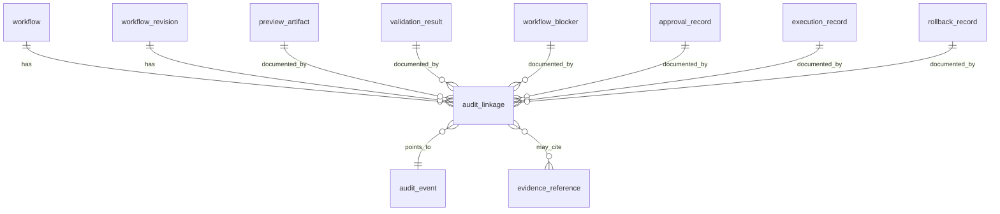

# Workflow Audit Relationships

## Purpose

This document defines how future workflow concepts should relate to audit records.

It is a design artifact only.

It does not introduce:

- an audit engine redesign
- workflow execution behavior
- approval behavior
- rollback behavior
- new audit APIs

## Phase Boundary

The platform remains in `Phase 2 — read-only product foundation`.

So this document must be treated as future-oriented audit-linkage groundwork only.

It exists to prevent future workflow, preview, validation, blocker, approval, and execution surfaces from drifting into inconsistent accountability models.

## Core Design Rule

Future workflow auditability should be modeled as explicit relationships between:

- durable workflow entities
- durable workflow artifacts
- durable audit events
- platform-owned evidence references

The audit relationship must not be collapsed into any one artifact.

`audit_linkage` should remain a relationship object, not a replacement for:

- `workflow`
- `preview_artifact`
- `validation_result`
- `workflow_blocker`
- `approval_record`
- `execution_record`
- `audit_event`

## Conceptual Audit Relationship Shape

The future audit-relationship model should stay explicit and normalized.

### `audit_linkage`

Purpose:

- bind one workflow-owned entity or artifact to one audit event
- preserve chronology and accountability without duplicating event content into the workflow object

Minimum future fields:

| Field | Type | Purpose |
| --- | --- | --- |
| `audit_linkage_id` | `string` | Stable audit-linkage identity. |
| `workflow_id` | `string` | Top-level workflow identity for the relationship. |
| `workflow_revision_id` | `string or null` | Specific workflow revision when the linkage is revision-scoped. |
| `linked_entity_kind` | `string` | `workflow`, `preview_artifact`, `validation_result`, `workflow_blocker`, `approval_record`, `execution_record`, or `rollback_record`. |
| `linked_entity_id` | `string` | Identity of the linked workflow-owned record. |
| `audit_event_id` | `string` | Linked audit-event identity. |
| `relationship_kind` | `string` | `emitted_by`, `documents`, `constrains`, `approves`, `rejects`, `observes`, or `summarizes`. |
| `chronology_role` | `string` | `request_time`, `preview_time`, `validation_time`, `approval_time`, `execution_time`, `rollback_time`, or `observation_time`. |
| `created_at` | `string` | When the linkage was recorded. |
| `link_reason` | `string` | Short normalized explanation of why this relationship exists. |
| `evidence_references` | `array` | Optional evidence references that explain the linkage. |
| `notes` | `array` | Additional honesty-preserving context. |

### `audit_event`

The future audit event should remain the durable record of something that happened or was recorded.

The linkage object should answer:

- which workflow-owned entity this event is related to
- why it is related
- where it belongs in the workflow chronology

The audit event should answer:

- what happened
- when it happened
- who or what recorded it
- what the bounded result or message was

## Entity-Specific Audit Linkages

### Workflow

Future `workflow` records should link to audit events that document:

- workflow creation
- workflow revision creation
- workflow state transitions
- workflow archival

The workflow object should not carry full audit-event payloads inline.

It should carry only stable references or derived summaries.

### Preview Artifact

Future `preview_artifact` records should link to audit events that document:

- preview generation requests
- preview generation completion
- preview generation blockage
- preview supersession by a later workflow revision

Preview audit linkage must not imply that preview generation equals approval or execution readiness.

### Validation Result

Future `validation_result` records should link to audit events that document:

- validation start
- validation completion
- validation failure
- validation blocked state
- validation supersession by later evidence or later revision

Validation audit linkage must remain separate from the validation result itself.

The result expresses the bounded conclusion.

The audit event expresses that the platform recorded or emitted that conclusion.

### Blocker State

Future `workflow_blocker` records should link to audit events that document:

- blocker creation
- blocker escalation or severity change
- blocker scope expansion or narrowing
- blocker clearance

Blocker audit linkage is necessary because blocker state may change over time even when the blocker code remains stable.

### Approval Record

Future `approval_record` records should link to audit events that document:

- approval request emitted
- approval granted
- approval rejected
- approval superseded

Approval linkage must preserve actor and timestamp accountability.

Approval state must not be inferred from unrelated workflow events.

### Execution Record

Future `execution_record` records should link to audit events that document:

- execution start
- execution checkpoint or observation events
- execution completion
- execution failure
- rollback request or rollback completion when later applicable

Execution linkage must remain separate from sync-derived read-side history.

Sync activity may later provide supporting evidence after execution, but it is not execution audit history by itself.

## Relationship Map

## Current Versus Future Audit Mapping

The current platform already has bounded audit-style history, but it is not future workflow audit history.

| Current structure | What it is now | What can be reused later | What must not be overread |
| --- | --- | --- | --- |
| `AuditEventRecord` in [platform/app-api/src/app_api/models/audit.py](platform/app-api/src/app_api/models/audit.py#L90) | A bounded read-only sync-derived audit-style event view | Event identity, timestamp, source, actor, target scope, result, message, and attached snapshot/comparison evidence patterns | It is not a workflow audit event family and it is not linked to workflow entities today. |
| `audit-event.schema.json` in [platform/schemas/audit/audit-event.schema.json](platform/schemas/audit/audit-event.schema.json) | A minimal generic audit-event contract baseline | High-level event fields such as `event_id`, `event_type`, `source`, `actor`, `target_scope`, `result`, and `occurred_at` | It is too small to represent future workflow-specific audit relationships by itself. |
| `build_audit_history_response` in [platform/app-api/src/app_api/services/audit_history.py](platform/app-api/src/app_api/services/audit_history.py#L1) | A mapper from persisted sync runs into bounded audit-history responses | Honest wording patterns and bounded evidence attachment behavior | It must not be treated as a workflow audit service or approval/execution audit service. |
| `WorkflowHistoryRecord` in [platform/app-api/src/app_api/models/workflow.py](platform/app-api/src/app_api/models/workflow.py#L90) | A bounded read-only workflow-style sync-history record | Some correlation and chronology vocabulary around persisted read-side activity | It is not a durable workflow instance and not a source of workflow audit linkage. |

## What Current History Can Be Reused Later

Current sync-derived history can be reused later as:

- evidence references supporting later workflow artifacts
- post-action observation context when later execution exists
- generic audit-event field patterns such as event identity, timestamp, source, actor, target scope, and bounded result
- bounded comparison evidence attached to future audit events where honest

## What Current History Cannot Be Reused As-Is

Current sync-derived history must not be reused as if it were:

- workflow creation history
- preview generation history
- validation-result history
- blocker-state history
- approval history
- execution history
- rollback history
- a complete operator accountability trail

## Reuse Boundary

If future workflow support wants to reference current sync-derived history, it should do so through:

- `evidence_reference`
- `audit_linkage`
- explicit notes explaining that the referenced event is post hoc read-side evidence

It should not relabel sync-derived events into operator workflow history.

## Explicit Non-Goals

This design does not define:

- a new audit engine architecture
- workflow execution semantics
- approval-state implementation
- rollback-state implementation
- durable storage schemas
- audit API endpoints
- event emission code
- background processing behavior

## Boundary Reminder

Future workflow auditability must be explicit and backend-owned.

But the current platform still exposes only sync-derived read-side history.

That distinction must remain visible in every later workflow contract or implementation.