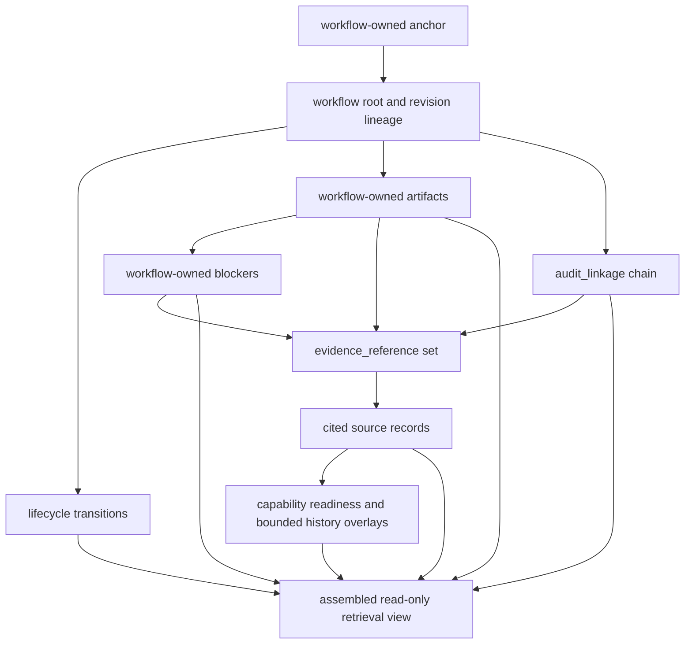

# Read-Only Retrieval Sequencing For Future Workflow-Owned Artifacts

## Purpose

This document defines the conceptual read-only retrieval order for future
workflow-owned records.

It exists to answer five bounded questions.

- what a later workflow retrieval surface must anchor on first
- how workflow-owned records should relate to `evidence_reference` and
  `audit_linkage`
- how blocked, incomplete, unavailable, historical, or partially populated
  workflow-owned records should be retrieved honestly
- which retrieval steps depend on future workflow-owned persistence
- which current `Phase 2` APIs and persisted records already support part of the
  retrieval chain

It is a design and sequencing artifact only.

It does not introduce:

- workflow APIs
- workflow persistence
- execution behavior
- dry-run endpoints
- approval retrieval behavior
- phase changes

## Phase Boundary

The platform remains in `Phase 2 — read-only product foundation`.

So this document must be read only as future retrieval-planning groundwork.

It must not be read as proof that workflow-owned records, workflow retrieval
endpoints, or workflow-linked audit history already exist.

## Core Rule

Future workflow retrieval must start from workflow-owned identities and then
resolve linked context outward.

The retrieval chain must not start from:

- current read-model responses
- sync-derived workflow-history views
- derived audit-history envelopes
- readiness summaries
- dashboard signals

Those surfaces may later support retrieval as cited context only.

They must not become the primary source of workflow truth.

## Retrieval Anchors

Every future read-only workflow retrieval should begin by choosing one explicit
anchor.

Allowed conceptual anchors:

- `workflow_id`
- `workflow_revision_id`
- `workflow_state_transition_id`
- `preview_id`
- `diff_artifact_id`
- `validation_result_id`
- `workflow_blocker_id`
- `execution_record_id`
- `rollback_record_id`

Disallowed anchors for primary workflow retrieval:

- `sync_run_id` by itself
- current `WorkflowHistoryRecord.workflow_id`
- current `AuditEventRecord.event_id` by itself
- readiness-summary rollups
- capability-summary rollups

Those current identifiers may help later evidence resolution, but they are not
future workflow-owned roots.

## Retrieval Domains

Future read-only retrieval should keep the following domains distinct.

| Retrieval domain | What it contains | What owns it later | What it must not be overread as |
| --- | --- | --- | --- |
| Workflow-owned core | `workflow`, `workflow_revision`, `workflow_state_transition` | Future backend-owned workflow domain | Current read-side evidence or sync history |
| Workflow-owned artifacts | `preview_artifact`, `diff_artifact`, `validation_result`, `workflow_blocker`, and later execution or rollback records | Future backend-owned workflow domain | Current readiness metadata or comparison summaries |
| Audit relationship layer | `audit_linkage` plus linked `audit_event` identities | Future backend-owned audit relationship layer | Workflow state by itself |
| Evidence citation layer | `evidence_reference` records attached to workflow-owned records or audit linkages | Future backend-owned citation layer | Copied evidence payloads |
| Source-record resolution layer | Current read models, persisted snapshots, comparison records, sync-run records, readiness snapshots, capability records, and integration-health records | Current backend-owned read and persistence layers | Workflow-owned state |
| Planning-support context | Current capability, readiness, and bounded history context | Current backend-owned Phase 2 contracts | Per-workflow-instance lifecycle or approval state |

## Relationship Rules

The retrieval model should preserve the following rules.

1. A workflow retrieval response must anchor on a workflow-owned record first,
   not on evidence or audit context.
2. Workflow-owned records may cite current evidence only through explicit
   `evidence_reference` identities rather than copied payload blobs.
3. Workflow-owned records may relate to audit events only through explicit
   `audit_linkage` identities rather than embedded audit-event payloads.
4. `audit_linkage` may itself cite `evidence_reference` records when the audit
   relationship needs bounded explanation or chronology support.
5. Current read-side evidence remains external to workflow-owned retrieval even
   when it is resolved and displayed alongside workflow-owned records.
6. Current readiness and capability records may contextualize workflow-owned
   blockers later, but they must not be promoted into workflow blockers unless a
   workflow-owned blocker record exists.
7. Current sync-derived and readiness-derived history may provide post hoc
   supporting context later, but they must not be promoted into workflow
   lifecycle chronology or workflow-grade audit linkage.
8. Historical retrieval must stay revision-scoped whenever a workflow revision
   anchor exists; it must not silently upgrade to the latest revision.
9. If a linked source record is unavailable, retrieval should preserve the
   workflow-owned reference and expose the linked unavailability honestly rather
   than fabricating replacement context.
10. Aggregate summaries and response projections should be retrieved only after
    stronger direct source records have been considered first.

## Retrieval Sequence Layers

Future workflow retrieval should proceed in the following order.

| Layer | Retrieval step | Why it comes here | Depends on future workflow-owned persistence | Current `Phase 2` support |
| --- | --- | --- | --- | --- |
| 1 | Resolve anchor and scope | Retrieval must begin from one explicit workflow-owned identity and requested scope before any linked context is gathered. | `yes` | `no` |
| 2 | Resolve workflow-owned root and revision lineage | The response needs the owning workflow and, when relevant, the exact revision before any artifact, blocker, or history interpretation can be honest. | `yes` | `no` |
| 3 | Resolve lifecycle transition chain | Current or historical posture depends on explicit workflow-owned chronology rather than presentation order. | `yes` | `no` |
| 4 | Resolve requested workflow-owned artifact set | Preview, diff, validation, blocker, execution, or rollback surfaces must be read as owned artifacts, not reconstructed from evidence. | `yes` | `no` |
| 5 | Resolve workflow-owned blocker relationships | A blocked or incomplete response needs explicit workflow-scoped blockers before capability or readiness context is attached. | `yes` | `no` for workflow blockers; `partial` for global readiness blockers only |
| 6 | Resolve `audit_linkage` records for the anchor scope | Audit chronology and relationship ordering belong after the workflow-owned anchor is known. | `yes` | `no` |
| 7 | Resolve `evidence_reference` records attached to workflow-owned records and audit linkages | Evidence citations explain or constrain the owned record, but they do not replace it. | `yes` for citation records themselves | `partial` because current source records already exist for many later citations |
| 8 | Resolve cited source records by `reference_kind` and `source_record_id` | Only after citation identities are known should retrieval expand into current read-side, persisted, or history evidence. | `mixed` | `yes` for current read models, persisted snapshots, sync runs, readiness snapshots, and capability/readiness context; `partial` for current comparison and embedded history summaries that still need explicit source identity |
| 9 | Resolve bounded planning-support overlays | Capability posture, readiness posture, and post hoc history context are supporting layers and should never outrank workflow-owned truth. | `no` for global Phase 2 context; `yes` for future workflow-scoped overlays | `yes` for current global capability, readiness, and bounded history context |
| 10 | Assemble read-only response posture | Only after all prior layers are resolved can the response say whether it is current, historical, blocked, partial, incomplete, or unavailable. | `yes` | `partial` because current posture semantics already exist but are not yet workflow-owned |

## Dependency Map

The dependency order should remain explicit.

### Ordering implications

1. `audit_linkage` retrieval depends on a workflow-owned anchor because the same
   audit event may later relate to multiple workflow-owned records.
2. `evidence_reference` retrieval depends on a known owning workflow record or
   audit linkage because citation meaning is relationship-scoped.
3. Source-record resolution depends on `source_record_id` and must prefer the
   cited direct record over a later-assembled UI projection.
4. Capability, readiness, and bounded history overlays come last because they
   constrain or explain the owned record; they do not define it.

## Source-Resolution Precedence

When multiple possible support surfaces exist, retrieval should prefer them in
this order.

1. Direct workflow-owned record for the requested scope.
2. Direct `audit_linkage` or `evidence_reference` attached to that record.
3. Durable underlying source records such as persisted snapshots, sync runs, or
   readiness snapshots.
4. Explicit current read-model records with stable object identity and explicit
   `served_at` posture.
5. Derived comparison summaries with explicit source identities.
6. Response-level projections and aggregate rollups only when no stronger
   source-record identity exists.

This precedence is necessary so later workflow retrieval does not treat:

- aggregate rollups as primary evidence
- current response envelopes as durable history
- reverse-chronological feeds as workflow ordering

## Retrieval Behavior By Posture

### Current retrieval

A current retrieval should resolve:

- the latest non-superseded workflow revision for the requested workflow scope
- the latest applicable workflow-owned state transition
- active workflow-owned blockers if any
- the latest attached audit linkages and evidence references relevant to the
  requested scope
- current supporting source records only when their chronology is marked as
  current or mixed explicitly

Current retrieval must not silently collapse historical citations into current
truth.

### Historical retrieval

Historical retrieval should resolve the exact requested workflow revision,
workflow-owned artifact, or state transition and keep all linked audit and
evidence resolution anchored to that historical point.

Historical retrieval must not silently swap in:

- the latest workflow revision
- the latest readiness summary
- the latest current read-model response

unless those records are cited separately as newer contextual overlays.

### Blocked retrieval

Blocked retrieval should resolve workflow-owned blockers before expanding into
supporting capability, readiness, and evidence context.

The response should then expose:

- which workflow-owned claim surface is blocked
- which blocker identities are active
- which capability, readiness, or evidence records explain the block

Current global readiness blockers may later support this explanation, but they
must remain external planning-support context unless a workflow-owned blocker
record cites them.

### Incomplete retrieval

Incomplete retrieval should return all available workflow-owned records plus
explicit missing-relation posture for absent child artifacts or linkages.

Examples:

- workflow exists but no preview artifact exists yet
- validation result exists but no audit linkage has been recorded yet
- workflow blocker exists but no explicit cited evidence has been attached yet

Incomplete retrieval must expose missing relationships explicitly rather than
omitting them silently.

### Unavailable retrieval

Unavailable retrieval applies when the requested workflow-owned anchor cannot be
resolved at all, or when a cited source record is no longer retrievable.

Rules:

1. If the workflow-owned anchor is unavailable, retrieval stops at the missing
   anchor boundary and must not fabricate workflow meaning from current read-side
   context.
2. If a cited source record is unavailable, retrieval should still return the
   `evidence_reference` or `audit_linkage` identity with explicit unavailable
   posture.
3. Current bounded history feeds may be cited as explanatory context only if
   they were already attached through explicit citation, not as replacement
   workflow truth.

### Partially populated retrieval

Partially populated retrieval applies when the workflow-owned anchor exists and
some related layers resolve, but others remain missing, bounded, or weaker.

Common examples:

- evidence references exist, but some cited comparison records still lack
  standalone source-record identities
- audit linkage exists, but the attached cited history source is only a bounded
  sync-run observation
- workflow blockers exist, but supporting capability context is global rather
  than workflow-scoped

The response should keep each partiality visible per layer rather than flattening
everything into one generic partial flag.

## What `Phase 2` Already Supports

Current `Phase 2` does not support workflow-owned retrieval.

But it already supports several source-resolution and supporting-context inputs
that later retrieval can rely on.

| Current `Phase 2` foundation | What it already supports later | What it still cannot support |
| --- | --- | --- |
| Persisted normalized inventory, topology, policy, and readiness snapshots | Strong direct source records for later `evidence_reference` resolution | Workflow roots, workflow revisions, or workflow-owned artifacts |
| Persisted sync-run records | Strong post hoc historical source records for later observation context and bounded audit explanation | Workflow creation, approval, execution, rollback, or workflow ordering |
| `/api/v1/devices`, `/api/v1/topology`, `/api/v1/policies` | Current read-model evidence context with serving-mode and posture semantics | Workflow-owned retrieval anchors or workflow lifecycle chronology |
| `/api/v1/capabilities` and current readiness structures | Global capability, blocker, prerequisite, and readiness-support context | Workflow-scoped blocker records or workflow eligibility decisions |
| `/api/v1/workflow-history` and `/api/v1/audit-history` | Operator-facing bounded history patterns and some reusable source vocabulary | Durable workflow history retrieval or workflow-grade audit linkage chains |
| Current comparison summaries and embedded history evidence | Bounded explanatory evidence once explicit source-record identities are defined | Standalone durable workflow validation or diff artifacts |

## Retrieval Steps That Require Future Workflow-Owned Persistence

The following steps cannot be supported honestly until future workflow-owned
persistence exists.

- resolving a `workflow_id` or `workflow_revision_id`
- resolving workflow lifecycle transitions as workflow chronology
- resolving workflow-owned blockers as distinct from global readiness blockers
- resolving `preview_artifact`, `diff_artifact`, `validation_result`,
  `execution_record`, or `rollback_record`
- resolving `audit_linkage` chains scoped to workflow-owned entities
- resolving workflow-owned `evidence_reference` attachment sets

## Retrieval Steps That Do Not Require New Workflow-Owned Persistence

The following supporting steps are already partly available because they resolve
current backend-owned evidence rather than future workflow-owned state.

- resolving persisted snapshot source records
- resolving persisted sync-run records
- resolving persisted readiness snapshots
- resolving current devices, topology, and policy read-model context
- resolving current capability and readiness-support context
- resolving current bounded history and audit envelopes as explanatory context

These current supports remain bounded and must stay downstream of a future
workflow-owned anchor.

## Explicit Non-Goals

This document does not define:

- workflow endpoint shapes
- query parameters or pagination
- approval retrieval semantics
- event-emission behavior
- migration plans
- storage schemas
- execution orchestration

## Conservative Bottom Line

Future read-only workflow retrieval must be layered.

- workflow-owned identities come first
- workflow-owned artifacts, blockers, and audit linkages come next
- evidence references and cited source records come after that
- current capability, readiness, and bounded history context come last as
  explanatory overlays

Current `Phase 2` already provides useful evidence and history foundations for
the lower layers of that chain.

It does not yet provide the workflow-owned anchor records that must exist before
true workflow retrieval can be introduced.