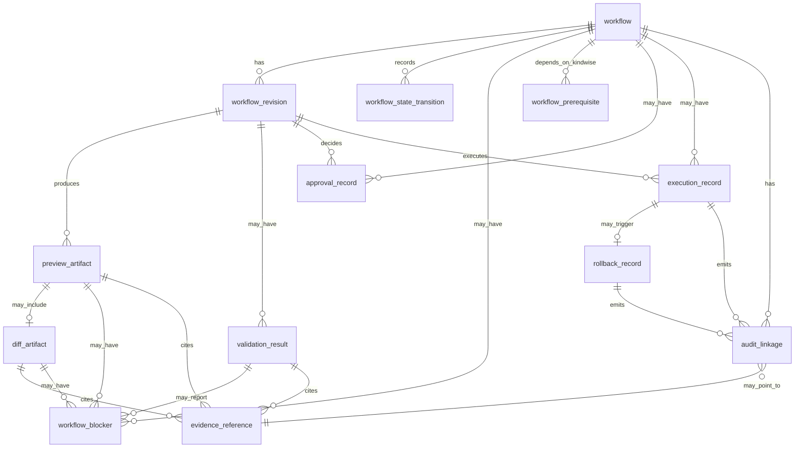

# Workflow Entity Model

## Purpose

This document defines the core workflow-related entities and relationships the platform would need for future bounded workflow support.

It is a domain-modeling document only.

It does not introduce:

- database tables
- backend behavior
- workflow APIs
- preview generation
- validation behavior
- approval behavior
- execution behavior
- rollback behavior

## Phase Boundary

The platform remains in `Phase 2 — read-only product foundation`.

So this entity model must be treated as future-oriented design groundwork only.

It exists to stabilize vocabulary and ownership boundaries before later schema, storage, and API design.

## Modeling Principles

- keep workflow entities backend-owned and vendor-neutral
- separate lifecycle posture from result artifacts
- separate blocker and prerequisite records from workflow core identity
- separate audit linkage from audit event content
- keep evidence references explicit rather than implied
- preserve explicit unsupported, partial, blocked, degraded, and unknown semantics

## Core Entities

The future workflow domain should be organized around the following core entities.

### 1. `workflow`

Purpose:

- the durable top-level workflow record
- the anchor object for later preview, validation, approval, execution, rollback, and audit linkage

Minimum future fields:

- `workflow_id`
- `workflow_kind`
- `requested_action`
- `scope`
- `intent_input`
- `lifecycle_state`
- `created_at`
- `updated_at`
- `requested_by`
- `current_revision`
- `notes`

This entity is future-facing.

Current Phase 2 analogue:

- no true analogue exists yet
- the current `WorkflowHistoryRecord` in [platform/app-api/src/app_api/models/workflow.py](platform/app-api/src/app_api/models/workflow.py#L90) is sync-history-shaped, not a durable workflow entity

### 2. `workflow_revision`

Purpose:

- a durable revision of a workflow request or intent input
- the stable anchor for preview, validation, and approval artifacts that belong to a specific revision

Minimum future fields:

- `workflow_revision_id`
- `workflow_id`
- `revision_number`
- `intent_input`
- `revision_summary`
- `created_at`
- `created_by`

This entity is future-only.

Current Phase 2 analogue:

- none

### 3. `workflow_state_transition`

Purpose:

- a durable record of one lifecycle transition for a workflow
- makes workflow stage history explicit instead of inferred from latest state only

Minimum future fields:

- `workflow_state_transition_id`
- `workflow_id`
- `from_state`
- `to_state`
- `transition_reason`
- `transitioned_at`
- `transitioned_by`

This entity is future-only.

Current Phase 2 analogue:

- none
- current sync-derived workflow history records reflect completed read-side sync activity rather than lifecycle transitions

### 4. `workflow_blocker`

Purpose:

- an explicit blocker that prevents a workflow or workflow artifact from progressing honestly

Minimum future fields:

- `workflow_blocker_id`
- `workflow_id or artifact_id`
- `blocker_code`
- `category`
- `severity`
- `summary`
- `affected_scope`
- `notes`

This entity is partly future-facing.

Current Phase 2 analogue:

- `DryRunReadinessBlocker` in [platform/app-api/src/app_api/schemas/capabilities.py](platform/app-api/src/app_api/schemas/capabilities.py#L89)
- the design-only contract is documented in [platform/schemas/workflows/blocker-contract.md](platform/schemas/workflows/blocker-contract.md)

Important boundary:

- current readiness blockers are planning-readiness blockers, not workflow-instance blockers

### 5. `workflow_prerequisite`

Purpose:

- a prerequisite condition or foundation area that a future workflow or preview path depends on

Minimum future fields:

- `workflow_prerequisite_id`
- `workflow_kind`
- `prerequisite_code`
- `status`
- `support_posture`
- `evidence_basis`
- `evidence_coverage`
- `notes`

This entity is partly future-facing.

Current Phase 2 analogue:

- `DryRunReadinessPrerequisite` in [platform/app-api/src/app_api/schemas/capabilities.py](platform/app-api/src/app_api/schemas/capabilities.py#L73)

Important boundary:

- current readiness prerequisites are global planning foundations, not per-workflow-instance prerequisites

### 6. `preview_artifact`

Purpose:

- the future bounded preview artifact attached to a specific workflow revision

Minimum future fields:

- `preview_id`
- `workflow_id`
- `workflow_revision_id`
- `preview_status`
- `summary`
- `preview_metadata`
- `generated_at`
- `generated_by`

This entity is future-only.

Current Phase 2 analogue:

- none
- the design-only contract is documented in [platform/schemas/workflows/preview-contract.md](platform/schemas/workflows/preview-contract.md)

### 7. `diff_artifact`

Purpose:

- the future normalized diff artifact attached to a preview artifact

Minimum future fields:

- `diff_artifact_id`
- `preview_id`
- `diff_status`
- `diff_kind`
- `change_counts`
- `changes`
- `generated_at`

This entity is future-only.

Current Phase 2 analogue:

- none
- the design-only contract is documented in [platform/schemas/workflows/diff-contract.md](platform/schemas/workflows/diff-contract.md)

### 8. `validation_result`

Purpose:

- the future bounded validation artifact tied to a workflow revision and optionally to a preview artifact

Minimum future fields:

- `validation_result_id`
- `workflow_id`
- `workflow_revision_id`
- `preview_id or null`
- `validation_status`
- `summary`
- `checks`
- `generated_at`
- `generated_by`

This entity is future-only.

Current Phase 2 analogue:

- none
- current comparison summaries and readiness metadata are explanatory support only and must not be treated as validation results
- the design-only contract is documented in [platform/schemas/workflows/validation-result-contract.md](platform/schemas/workflows/validation-result-contract.md)

### 9. `approval_record`

Purpose:

- the future explicit approval or rejection decision attached to a workflow revision

Minimum future fields:

- `approval_record_id`
- `workflow_id`
- `workflow_revision_id`
- `decision`
- `decision_summary`
- `decided_at`
- `decided_by`

This entity is future-only.

Current Phase 2 analogue:

- none

### 10. `execution_record`

Purpose:

- the future execution attempt record for a workflow revision

Minimum future fields:

- `execution_record_id`
- `workflow_id`
- `workflow_revision_id`
- `execution_status`
- `started_at`
- `finished_at`
- `execution_summary`
- `notes`

This entity is future-only.

Current Phase 2 analogue:

- none
- current sync-run history is not workflow execution

### 11. `rollback_record`

Purpose:

- the future rollback attempt record tied to a failed or explicitly rolled-back execution

Minimum future fields:

- `rollback_record_id`
- `workflow_id`
- `execution_record_id`
- `rollback_status`
- `started_at`
- `finished_at`
- `rollback_summary`

This entity is future-only.

Current Phase 2 analogue:

- none

### 12. `audit_linkage`

Purpose:

- the future relationship record that binds workflow entities to audit events and audit-relevant artifacts without collapsing them into one object

Minimum future fields:

- `audit_linkage_id`
- `workflow_id`
- `linked_entity_kind`
- `linked_entity_id`
- `audit_event_id`
- `link_reason`

This entity is future-only.

Current Phase 2 analogue:

- none
- current audit records in [platform/app-api/src/app_api/models/audit.py](platform/app-api/src/app_api/models/audit.py#L90) are sync-derived event views, not workflow-linked audit relationships
- the design-only relationship model is documented in [platform/schemas/workflows/audit-relationships.md](platform/schemas/workflows/audit-relationships.md)

### 13. `evidence_reference`

Purpose:

- a normalized reference to the platform-owned evidence used by a workflow artifact or blocker record

Minimum future fields:

- `evidence_reference_id`
- `reference_kind`
- `reference_id`
- `source_domain`
- `observed_at`
- `persisted_at`
- `freshness_posture`
- `confidence_posture`
- `notes`

This entity is partly future-facing.

Current Phase 2 analogue:

- no dedicated entity exists yet
- the preview contract design in [platform/schemas/workflows/preview-contract.md](platform/schemas/workflows/preview-contract.md) already defines the intended contract shape
- the explicit identity and citation rules are defined in [platform/schemas/workflows/evidence-reference-contract.md](platform/schemas/workflows/evidence-reference-contract.md)
- current snapshot summaries and comparison context in [platform/app-api/src/app_api/models/workflow.py](platform/app-api/src/app_api/models/workflow.py#L1) and [platform/app-api/src/app_api/models/audit.py](platform/app-api/src/app_api/models/audit.py#L1) are the closest structural evidence carriers

## Relationship Map

The future entity relationship model should remain explicit and layered.

## Relationship Notes

- `workflow` is the root entity.
- `workflow_revision` exists so preview, validation, and approval artifacts can be tied to a specific request revision.
- `preview_artifact`, `diff_artifact`, and `validation_result` are separate artifacts and must not be collapsed into one overloaded field.
- `audit_linkage` is a relationship object, not a replacement for audit events.
- `workflow_blocker` can apply at workflow level or artifact level.
- `evidence_reference` is reusable across preview, diff, validation, and audit linkage.

## Current Phase 2 To Future Workflow Mapping

The current platform has partial analogues for some future entities, but not the entities themselves.

| Future workflow entity | Current Phase 2 analogue | Current status | Important boundary |
| --- | --- | --- | --- |
| `workflow` | `WorkflowHistoryRecord` | partial analogue only | Current record is sync-history shaped, not a durable workflow instance. |
| `workflow_state_transition` | none | not present | No durable lifecycle transition model exists. |
| `workflow_blocker` | `DryRunReadinessBlocker` | partial analogue only | Current blocker records are global planning-readiness blockers, not workflow-instance blockers. |
| `workflow_prerequisite` | `DryRunReadinessPrerequisite` | partial analogue only | Current prerequisites describe platform readiness, not per-workflow prerequisites. |
| `preview_artifact` | none | not present | Only design docs exist today. |
| `diff_artifact` | none | not present | Only design docs exist today. |
| `validation_result` | none | not present | Current comparison/readiness outputs are not validation results. |
| `approval_record` | none | not present | No approval model exists in Phase 2. |
| `execution_record` | sync-run history | misleading analogue only | Sync runs are read-side ingestion records, not workflow execution. |
| `rollback_record` | none | not present | No rollback model exists. |
| `audit_linkage` | `AuditEventRecord` correlation fields | partial analogue only | Current audit events are sync-derived and not linked to workflow entities. |
| `evidence_reference` | snapshot summaries and comparison summaries | partial analogue only | Current evidence is embedded in history/readiness surfaces, not normalized as a shared entity. |

## Current Implemented Structures That Should Not Be Overread

The following current structures are useful groundwork but must not be mistaken for future workflow entities:

- `WorkflowHistoryRecord` in [platform/app-api/src/app_api/models/workflow.py](platform/app-api/src/app_api/models/workflow.py#L90)
- `AuditEventRecord` in [platform/app-api/src/app_api/models/audit.py](platform/app-api/src/app_api/models/audit.py#L90)
- `DryRunReadinessPrerequisite` in [platform/app-api/src/app_api/schemas/capabilities.py](platform/app-api/src/app_api/schemas/capabilities.py#L73)
- `DryRunReadinessBlocker` in [platform/app-api/src/app_api/schemas/capabilities.py](platform/app-api/src/app_api/schemas/capabilities.py#L89)
- `workflow-record.schema.json` in [platform/schemas/workflows/workflow-record.schema.json](platform/schemas/workflows/workflow-record.schema.json)

These are all bounded Phase 2 artifacts.

They help clarify future domain needs, but they are not proof that durable workflow support already exists.

## Future-Only Concepts Summary

The following entities should be treated as future-only until later workflow phases:

- `workflow_revision`
- `workflow_state_transition`
- `preview_artifact`
- `diff_artifact`
- `validation_result`
- `approval_record`
- `execution_record`
- `rollback_record`
- `audit_linkage`

## Partially Grounded Concepts Summary

The following concepts have partial groundwork in Phase 2 but are not fully realized entities yet:

- `workflow`
- `workflow_blocker`
- `workflow_prerequisite`
- `evidence_reference`

## Boundary Reminder

This entity model is intentionally bounded.

It defines domain language and ownership only.

It does not authorize workflow APIs, storage design, or implementation work in the current phase.